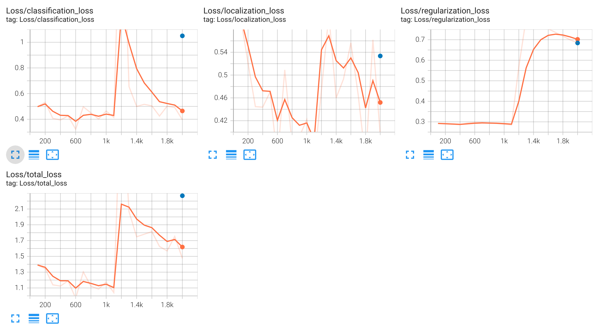
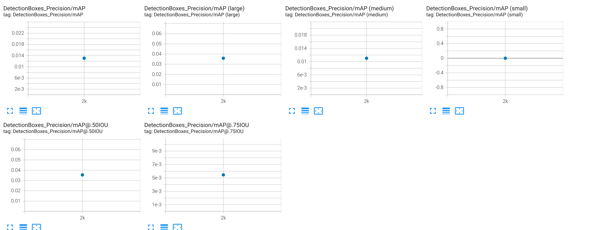
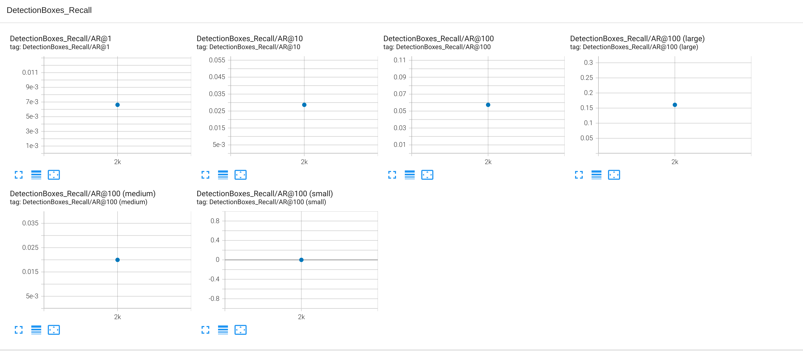
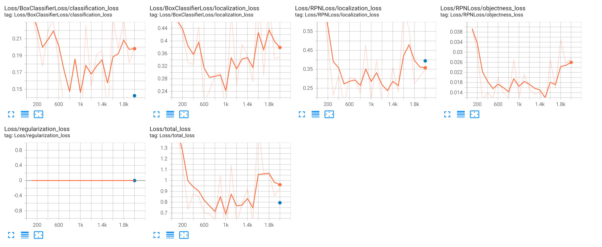
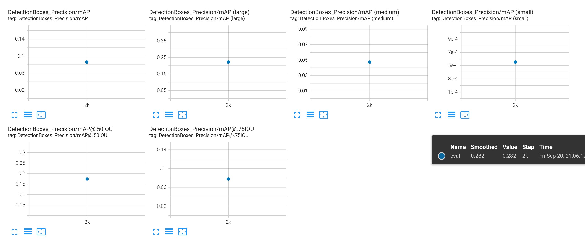
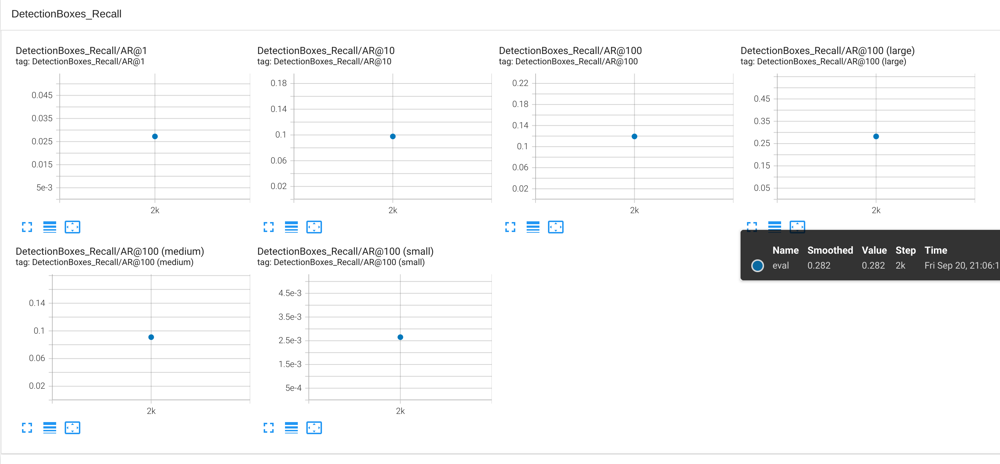

# Self-Driving Car Engineer Nanodegree Program: Object Detection in Urban Environments

## By Ali Afzal (ali.afzal9697@gmail.com)

## Introduction

This project focuses on implementing object detection and classification using data from Waymo. Utilizing a pretrained neural network, we will work with a dataset of urban environment images annotated with cyclists, pedestrians, and vehicles. Key tasks include monitoring model training with TensorBoard, determining optimal stopping points, and experimenting with hyperparameters to enhance performance.

The project integrates the TensorFlow Object Detection API, enabling deployment of the model to generate predictions for images. Additionally, a short video is provided for each model, showcasing the model's predictions in action.

## Objectives

The primary objectives of the project submission are as follows:

1. **Evaluate Multiple Pretrained Models**
    - Test at least two pretrained models.
    - Update and submit the pipeline.config file and notebooks for each model tested.
2. **Select the Best Model for Deployment**
    - Write a brief summary of your experiments, including the accuracy (mAP) values of all tested models.
    - Analyze and discuss the following:
        - How the validation loss compares to the training loss.
        - Whether the observed behavior of the losses/metrics aligns with expectations.
        - Strategies to further improve the performance of the tested models.
3. **Deploy and Run Inference with the Best Model**
    - Deploy the best model in AWS by completing and executing `2_deploy_model.ipynb`.
    - Generate an output video highlighting vehicle, pedestrian, and cyclist detections using the deployed model.

## TensorFlow Object Detection API

The TensorFlow Object Detection API simplifies the development and training of state-of-the-art models. You can find pre-trained models in the [Model Zoo](https://github.com/tensorflow/models/blob/master/research/object_detection/g3doc/tf2_detection_zoo.md).

## Object Detection Models Evaluation

### SSD ResNet

The config file was based on the SSD ResNet model from the Model Zoo. It can be found [here](https://github.com/tensorflow/models/blob/master/research/object_detection/configs/tf2/ssd_resnet50_v1_fpn_1024x1024_coco17_tpu-8.config). It is then modified to link to the Waymo dataset on S3, which can be found [here](1_model_training/source_dir/ssd_resnet50_v1_fpn_1024x1024_coco17_tpu.config).

#### Results and Discussion

The trained loss and mean average precision (mAP) of the SSD ResNet model are shown below:

- **Mean Average Precision (mAP):** 0.014
- **Average Recall:** 0.006
- **Validation Loss:** 2.268
- **Training Loss:** 1.619

The model is struggling to correctly detect and classify objects, with higher validation loss compared to training loss suggesting overfitting. The very low mAP and recall indicate poor performance on the validation set.

**Strategies to Improve:**
- Fine-tune learning rates and data augmentation strategies to stabilize losses.

### Faster R-CNN ResNet152

The config file was based on the Faster R-CNN ResNet152 model from the Model Zoo. It can be found [here](https://github.com/tensorflow/models/blob/master/research/object_detection/configs/tf2/faster_rcnn_resnet152_v1_640x640_coco17_tpu-8.config). It is then modified to link to the Waymo dataset on S3, which can be found [here](1_model_training/source_dir/faster_rcnn_resnet152.config).

#### Results and Discussion

- **Overall mAP:** ~0.1
- **Large Objects mAP:** ~0.25
- **Medium Objects mAP:** ~0.05
- **Small Objects mAP:** ~0.0005
- **AR@1:** ~0.025
- **AR@100 (overall):** ~0.14
- **Large Objects AR:** ~0.25
- **Small Objects AR:** ~0.0025
- **Total Loss:** Stabilizes at ~0.9

The model struggles to make accurate predictions, especially for small objects. The higher mAP for large objects suggests better performance for larger objects.

**Strategies to Improve:**
- Fine-tune learning rates and data augmentation strategies to stabilize losses.

### Inference Video

From the above results, the Faster R-CNN model is selected for deployment. The video can be seen below:

